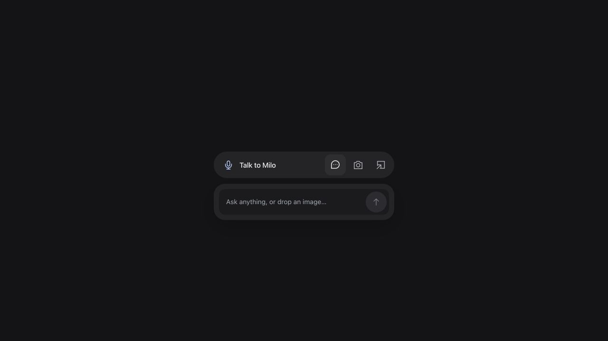

<p align="center">
  
</p>

<p align="center">
  <strong>A voice research companion. Right beside what you're reading.</strong><br />
  Ask aloud. Share a screenshot. Check the sources.
</p>

<p align="center">
  <strong><a href="https://youtu.be/Ui12-fGMX9M">Watch the demo ↗</a></strong> &nbsp;·&nbsp;
  <a href="#quick-start">Quick start</a> &nbsp;·&nbsp;
  <a href="https://devpost.com/software/milo-ni2mch">Project story</a>
</p>

---

Something sounds off? Ask Milo. It searches public sources, talks through what it finds, and gives you links to check for yourself.

- **Ask naturally.** Voice or text, with follow-up questions.
- **Show the claim.** Capture a screen, or drop, paste or upload an image.
- **Keep your place.** Float Milo beside the page in supported desktop browsers, or use it in a tab.

No installation. No continuous screen watching.

<p align="center">
  
</p>

## Quick start

Requires **Node.js 22.13+** and an OpenAI API key with access to `gpt-live-1` and `gpt-5.6-terra`. API usage is billed to your project.

```sh
git clone https://github.com/Yun-0000/Milo.git
cd Milo
npm ci
cp .env.example .env
```

Set `OPENAI_API_KEY` in `.env`, then run:

```sh
npm run dev
```

Open **[localhost:5173](http://127.0.0.1:5173)** → **Talk to Milo**. The speech bubble switches to typing; the camera adds an image.

<details>
<summary><strong>Self-hosting & development</strong></summary>

```sh
npm test
npm run typecheck
npm run build
npm start
```

The production server runs at [localhost:3000](http://127.0.0.1:3000). Deployment options: [Docker](Dockerfile) · [Render](render.yaml).

Set `OPENAI_API_KEY` and a strong `MILO_ACCESS_CODE` as hosting secrets. Use HTTPS. The server uses in-memory storage and is designed for a single-instance preview.

React · TypeScript · Express · WebRTC · OpenAI

</details>

### A note on privacy & accuracy

API keys stay server-side. Voice, questions and requested images are processed by OpenAI—avoid sensitive material. Screen sharing stops after capture; server-held results are temporary.

Milo can misread images or get answers wrong. Sources are there for you to verify, not a guarantee of accuracy.

---

<p align="center"><sub><a href="LICENSE">License</a> &nbsp;·&nbsp; <a href="https://github.com/Yun-0000/Milo/issues">Report an issue</a></sub></p>
